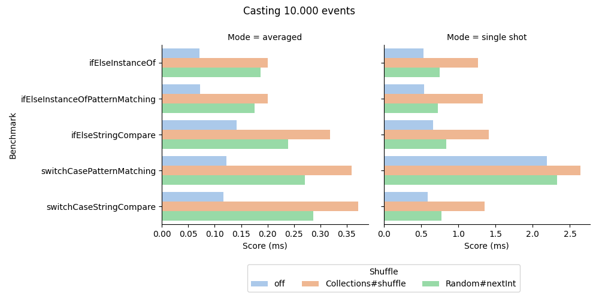

# Event casting benchmark

Casting a stream of unspecific events into concrete event classes is common in event sourced system. 
This benchmark explores the use of 
- `String.equals()`, and 
- `instanceof`

in combination with 
- if-else, 
- switch-case, and
- pattern matching.

# Running the benchmark
Make sure you use Java 17 and an up-to-date maven.

- build with `mvn clean package`,
- run with `java --enable-preview -jar target/benchmarks.jar`

# Results

